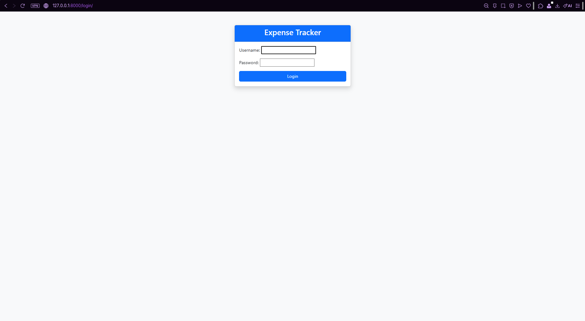
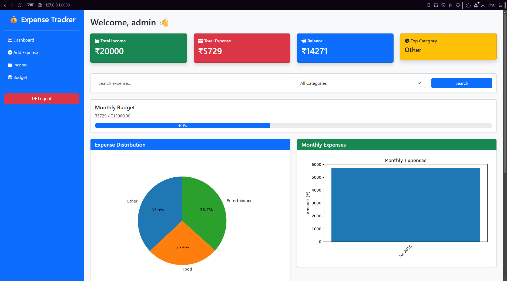
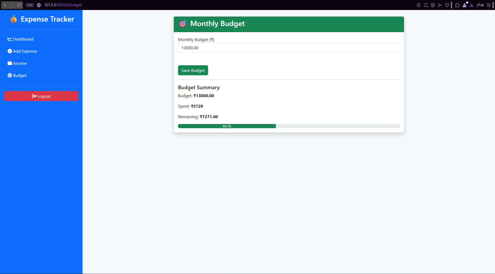
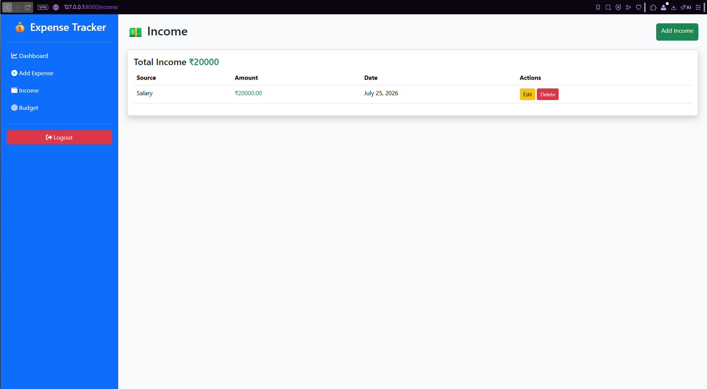

# 💰 Expense Tracker

A full-stack Expense Tracker web application built with **Django** that helps users manage their personal finances by tracking expenses, income, and monthly budgets through an interactive dashboard.

---

## 📌 Features

- 🔐 User Authentication (Login & Logout)
- 💸 Add, Edit, and Delete Expenses
- 💰 Manage Income
- 🎯 Monthly Budget Tracking
- 📊 Dashboard with Charts
- 🔍 Search Expenses
- 🗂️ Category-wise Expense Tracking
- 📈 Monthly Expense Analysis
- 📱 Responsive Bootstrap Interface

---

## 🛠️ Tech Stack

| Technology | Purpose |
|------------|---------|
| Python | Backend |
| Django | Web Framework |
| SQLite | Database |
| Bootstrap 5 | Frontend UI |
| HTML5 | Templates |
| CSS3 | Styling |
| Matplotlib | Charts |
| Font Awesome | Icons |

---

## 📂 Project Structure

```
Expense-Tracker/
│
├── expense_tracker/
├── tracker/
├── manage.py
├── requirements.txt
└── README.md
```

---

## 🚀 Installation

### 1. Clone the repository

```bash
git clone https://github.com/YOUR_USERNAME/Expense-Tracker.git
```

### 2. Move into the project

```bash
cd Expense-Tracker
```

### 3. Create a virtual environment

Windows

```bash
python -m venv venv
venv\Scripts\activate
```

Linux/macOS

```bash
python3 -m venv venv
source venv/bin/activate
```

### 4. Install dependencies

```bash
pip install -r requirements.txt
```

### 5. Apply migrations

```bash
python manage.py migrate
```

### 6. Run the server

```bash
python manage.py runserver
```

Open

```
http://127.0.0.1:8000/
```

---

## 📸 Screenshots

### Login



### Dashboard



### Budget



### Income



## 📊 Future Improvements

- Export reports to PDF
- Export to Excel/CSV
- Interactive Chart.js dashboard
- Dark Mode
- Email notifications
- Recurring expenses
- AI-based spending insights

---

## 🎯 Learning Outcomes

This project helped me gain hands-on experience with:

- Django Authentication
- Django ORM
- CRUD Operations
- Template Inheritance
- Bootstrap UI Design
- Data Visualization
- Database Management
- Git & GitHub Workflow

---

## 👨‍💻 Author

**Vishva**

GitHub: https://github.com/vishvahrathan2025    

LinkedIn: https://www.linkedin.com/in/vishvahrathan-meenakumar-023179387/